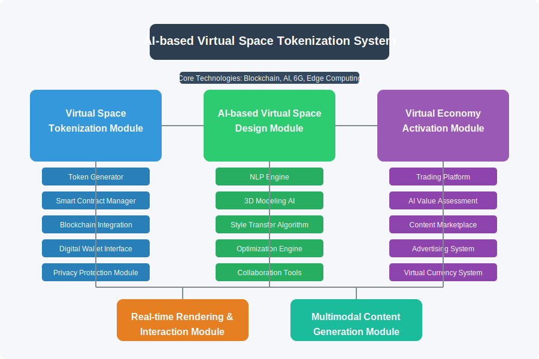

# AI-based Virtual Space Tokenization and Trading System

This repository contains the implementation for an advanced AI-based Virtual Space Tokenization and Trading System that enables users to tokenize, own, trade, develop, lease, and invest in virtual reality (VR) and augmented reality (AR) spaces using blockchain technology.

## System Architecture



Our system integrates cutting-edge technologies to create a new form of digital real estate market, with five major modules working in harmony to deliver a seamless experience.

## Technology Stack


Our technology stack features a comprehensive layered architecture from hardware to application level, integrating blockchain, AI, 6G, and advanced sensing technologies.

## Core Technologies

- **Blockchain & NFTs**: For transparent ownership verification and secure transactions
- **Artificial Intelligence**: For personalized virtual space design and value assessment
- **6G Networks**: Enabling ultra-low latency and high-quality virtual space experiences
- **Edge AI**: For real-time rendering and optimization of virtual spaces
- **Biometric Sensing**: Utilizing frequency-scanning impedance technology for personalized user experience

## Key Modules

### 1. Virtual Space Tokenization Module

- **Token Generator**: Creates unique NFTs for virtual spaces with metadata
- **Smart Contract Manager**: Handles ownership, transfer, and usage rights
- **Blockchain Integration**: Records all transactions on a distributed ledger
- **Digital Wallet Interface**: Secure storage and management of virtual space tokens
- **Privacy Protection Module**: Uses homomorphic encryption to protect user data

### 2. AI-based Virtual Space Design Module

- **Natural Language Processing Engine**: Interprets user requirements through voice/text
- **3D Modeling AI**: Generates 3D models based on user specifications
- **Style Transfer Algorithm**: Applies desired styles and ambiances to virtual spaces
- **Optimization Engine**: Ensures virtual spaces run smoothly across different devices
- **Collaboration Tools**: Facilitates multi-user design and development

### 3. Virtual Economy Activation Module

- **Trading Platform**: Facilitates buying, selling, and leasing of virtual spaces
- **AI Value Assessment System**: Analyzes and determines the value of virtual spaces
- **Content Marketplace**: Platform for trading virtual objects and content
- **Advertising System**: Enables monetization through virtual space advertising
- **Virtual Currency System**: Manages the virtual economy's monetary system

### 4. Real-time Rendering and Interaction Module

- **6G Network Integration**: Utilizes ultra-fast networks for real-time data transfer
- **High-Performance GPU Rendering**: Delivers high-quality graphics with minimal latency
- **Haptic Feedback System**: Provides tactile interaction with virtual objects
- **Brain-Computer Interface**: Allows intuitive control through neural signals

### 5. Multimodal Content Generation and Management Module

- **Real-time Speech-to-Text Conversion**: Enables natural communication 
- **Real-time 3D Avatar Creation**: Represents users in the virtual space
- **AI-based Real-time Dubbing**: Facilitates multilingual communication
- **Content Management System**: Organizes and distributes virtual content

## Advanced Technical Features

### Wearable Integration
- Lightweight AR/VR headsets (< 200g) with 4K resolution per eye
- Full-body haptic suits with 40+ tactile actuators
- Multi-sensor biometric systems (EEG, ECG, GSR) with 1kHz sampling rate

### Ultra-fast Communication
- 6G network with 1Tbps peak speed and 0.1ms latency
- Real-time hologram communication (60fps)
- Tactile internet for high-fidelity haptic feedback

### Mobile Supercomputing
- On-device AI processing for real-time environmental mapping
- Distributed cloud rendering with 90+ fps at 4K resolution
- Smart power management for 30% improved energy efficiency

### Quantum Technologies
- Quantum entanglement-based data transmission systems
- Quantum computing for economic simulation and prediction
- Quantum neural networks for behavioral pattern analysis

### Biometric Personalization
- Frequency-scanning impedance technology for user identification
- Custom frequency profile generation for each user
- Adaptive systems that respond to emotional and physiological states

## Applications

This technology can be applied to numerous industries:

- **Real Estate**: Virtual property development, trading, and leasing
- **Gaming**: Enhanced ownership systems and virtual economies
- **Entertainment**: Virtual concerts, exhibitions, and events
- **Education**: Immersive virtual campuses and classrooms
- **Retail**: 3D product showcases and virtual shopping experiences
- **Advertising**: New advertising formats in virtual spaces
- **Tourism**: Virtual travel experiences and guides
- **Healthcare**: Virtual hospitals and rehabilitation spaces
- **Finance**: Virtual asset management and cryptocurrency integration
- **Architecture**: Virtual building and urban planning

## Getting Started

### Prerequisites
- Node.js 16+
- Ethereum development environment (Hardhat/Truffle)
- WebGL-compatible browser
- 6G network simulator (for development testing)

### Installation
```bash
# Clone the repository
git clone https://github.com/JJshome/VirtualSpaceTokenization.git

# Install dependencies
cd VirtualSpaceTokenization
npm install

# Build the project
npm run build

# Run development server
npm run dev
```

## Documentation

For detailed documentation, please refer to the [docs](doc/) directory.

## Contributing

Contributions are welcome! Please read the [CONTRIBUTING.md](CONTRIBUTING.md) file for details on our code of conduct and the process for submitting pull requests.

## License

This project is licensed under the MIT License - see the [LICENSE](LICENSE) file for details.

## Acknowledgements

- This project builds on research in blockchain tokenization, AI-based design, and virtual reality interaction
- Special thanks to all researchers and developers contributing to the fields of VR/AR, blockchain, and AI technologies