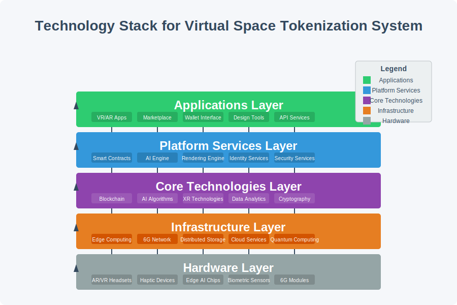

# AI-based Virtual Space Tokenization and Trading System


A next-generation platform for creating, tokenizing, and trading virtual spaces using AI, blockchain, and advanced XR technologies.

## Overview

The AI-based Virtual Space Tokenization and Trading System revolutionizes the way virtual spaces in VR/AR environments are created, owned, and traded. By combining cutting-edge technologies including AI-generated content, blockchain-based tokenization, and 6G ultra-low latency communications, this system creates an immersive, secure, and user-friendly ecosystem for the virtual real estate market.

## Key Features

### 🧠 AI-Driven Space Creation
- Generate immersive VR/AR spaces using natural language descriptions
- Apply style transfer for unique visual aesthetics
- AI optimizes spaces for user experience and functionality
- Create realistic, physically accurate environments with minimal technical expertise

### 🔗 Blockchain-Based Tokenization
- Tokenize virtual spaces as NFTs (Non-Fungible Tokens) on the blockchain
- Secure, transparent ownership records
- Immutable transaction history
- Smart contracts for automated transactions and royalties

### 💹 Virtual Economy Marketplace
- AI-based value assessment for fair pricing
- Secure trading platform with escrow capabilities
- Secondary market for reselling and renting virtual spaces
- Auction system for unique or high-demand properties

### 🌐 Advanced User Experience
- 6G network integration for ultra-low latency (< 0.1ms)
- Haptic feedback with 40+ tactile actuators
- Biometric data integration for personalized experiences
- Multi-user collaboration in shared virtual spaces

### 🔒 Security and Privacy
- Homomorphic encryption for sensitive data
- Hardware security modules for key protection
- Decentralized identity verification
- Robust access control systems

## System Architecture


The system is built on a modular architecture that integrates multiple advanced technologies:

1. **Virtual Space Tokenization Module**: Handles the creation of blockchain-based tokens that represent ownership of virtual spaces, ensuring secure and transparent property rights.

2. **AI-based Virtual Space Design Module**: Leverages deep learning models to generate and customize virtual environments based on user specifications and preferences.

3. **Virtual Economy Activation Module**: Manages the marketplace, trading platform, and value assessment systems that enable the buying, selling, and leasing of virtual properties.

4. **Real-time Rendering & Interaction Module**: Provides high-performance rendering capabilities and responsive user interactions through 6G networks and edge computing.

5. **Multimodal Content Generation Module**: Creates and manages diverse content types within virtual spaces, including visual, audio, and interactive elements.

6. **Security & Privacy Module**: Ensures the protection of user data, transaction integrity, and access controls throughout the system.

## Technology Stack



### Hardware Layer
- AR/VR headsets with 4K+ per-eye resolution
- Haptic devices with 40+ tactile feedback channels
- Edge AI chips for on-device processing
- Biometric sensors for user authentication and experience personalization
- Hardware security modules for cryptographic operations

### Infrastructure Layer
- 6G network infrastructure (1Tbps speed, 0.1ms latency)
- Edge computing servers for real-time processing
- Blockchain network for distributed ledger
- Cloud-based AI services for resource-intensive operations

### Core Technologies Layer
- Smart contract systems for automated transactions
- Deep learning models for space generation and customization
- 3D rendering engines for immersive visualization
- Multimodal data processing for diverse content types
- Homomorphic encryption for privacy-preserving computation

### Platform Services Layer
- Tokenization services for creating and managing NFTs
- AI-based design tools for virtual space creation
- Economic services for marketplace operations
- Security services for authentication and access control
- Content management systems for virtual assets

### Application Layer
- User interfaces for VR/AR environments
- Mobile applications for on-the-go access
- Developer APIs for third-party integration
- Analytics dashboards for performance monitoring

## User Experience


The system provides an end-to-end user experience that encompasses:

1. **Creation**: Users can describe their desired virtual space in natural language, and the AI system generates a fully-realized 3D environment that matches their specifications.

2. **Customization**: Intuitive tools allow users to refine and personalize their spaces, applying different styles, adding objects, and adjusting parameters to achieve their vision.

3. **Tokenization**: Once satisfied with their creation, users can tokenize their virtual space as an NFT on the blockchain, establishing verifiable ownership.

4. **Valuation**: The AI-based value assessment system analyzes various factors to determine a fair market value for the space, considering design quality, location, features, and market trends.

5. **Trading**: Users can list their spaces on the marketplace, set prices or create auctions, and securely transfer ownership through smart contracts.

6. **Utilization**: Owners and authorized users can access and utilize virtual spaces through VR/AR devices, experiencing high-fidelity environments with realistic interactions.

## Implementation Workflow

The system implementation follows a comprehensive workflow:

1. **Space Creation**:
   - User provides natural language description or parameters
   - AI generates the basic spatial layout
   - Style transfer algorithms apply visual aesthetics
   - Physics simulation ensures realistic environment behavior

2. **Tokenization**:
   - Space metadata is generated and packaged
   - NFT is minted on the blockchain
   - Ownership is assigned to the creator
   - Smart contract terms are established

3. **Marketplace Integration**:
   - Space is assessed for value by AI algorithms
   - Owner sets listing parameters (price, auction, etc.)
   - Listing is published to the marketplace
   - Potential buyers can preview the space

4. **Transaction Processing**:
   - Buyer initiates purchase or winning bid
   - Smart contract manages the transaction
   - Funds and ownership are transferred securely
   - Transaction is recorded on the blockchain

5. **Space Utilization**:
   - New owner gains access rights
   - Space can be accessed through compatible devices
   - Multiple users can share the space if permitted
   - Modifications can be made within ownership rights

## Getting Started

### Prerequisites

- Node.js 18.0 or higher
- Python 3.9 or higher
- TensorFlow 2.10 or higher
- Web3.js 1.8.0 or higher
- Solidity 0.8.18 or higher
- AR/VR compatible hardware for full experience

### Installation

```bash
# Clone the repository
git clone https://github.com/JJshome/VirtualSpaceTokenization.git

# Install dependencies
cd VirtualSpaceTokenization
npm install
pip install -r requirements.txt

# Set up blockchain connection
cp .env.example .env
# Edit .env with your blockchain provider details

# Start the development server
npm start
```

### Running the Simulation

```bash
# Navigate to the simulation directory
cd deployment/simulation

# Install simulation dependencies
npm install

# Start the simulation
npm run simulation

# Open the web interface (in a new terminal)
npm run web-ui
```

## Directory Structure

- `src/`: Source code for the main system
  - `tokenization/`: Blockchain and tokenization components
  - `ai_design/`: AI-based space generation tools
  - `economy/`: Marketplace and trading functionality
  - `rendering/`: 3D rendering and visualization
  - `multimodal/`: Content generation and management
  - `security/`: Security and privacy protection

- `doc/`: Documentation and guides
  - `architecture/`: System architecture details
  - `api/`: API documentation
  - `user_guides/`: End-user documentation
  - `images/`: Diagrams and visual aids

- `deployment/`: Deployment and configuration
  - `docker/`: Docker configuration
  - `kubernetes/`: Kubernetes manifests
  - `simulation/`: Simulation environment
  - `monitoring/`: System monitoring tools

- `Scientific_papers/`: Relevant research papers and references

## Simulation Environment

The system includes a comprehensive simulation environment that allows developers and researchers to experiment with various aspects of the platform:

- Generate virtual spaces with different parameters
- Test tokenization processes on a local blockchain
- Simulate marketplace activities and price dynamics
- Analyze system performance under various conditions
- Visualize user interactions and experiences

## Future Developments

The system is designed for continuous evolution with planned features including:

- Integration with physical world IoT devices
- Enhanced AI capabilities for more realistic environments
- Expanded cross-platform compatibility
- Advanced economic models for virtual real estate
- Support for more diverse virtual space applications (education, healthcare, etc.)

Patent Pending
